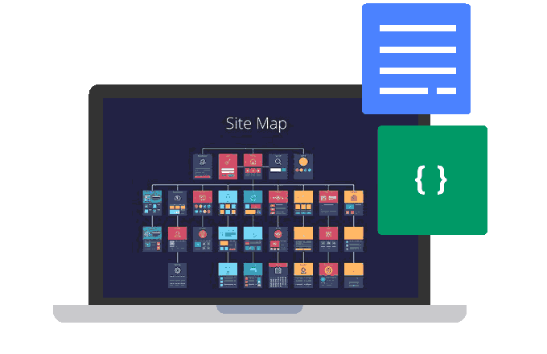

<!-- default _coverpage.md -->

    

        <a href="#/" class="logo"> XOOPSCube Project</a>
        <ul class="navmain">
        <li><a href="#/en/development/" class="nav-links"> Development</a></li>
        <li><a href="#/en/design/" class="nav-links"> Design</a></li>
        <li><a href="#/en/delivery/" class="nav-links"> Deployment</a></li>
        <li><a href="https://github.com/xoopscube" class="nav-links" target="_blank"> Github</a></li>
        </ul>
    

<!-- Card-list -->

<h2 class="hero-title">Getting Started with XCL—Simple, Secure and Scalable Web Application Platform</h2>

    

    

        <h2>Development Tools</h2>
        
Build, manage and deploy a scalable Web Application Platform and Content Management System.

        <a href="#/en/development/"> Development</a>
    

    

    

        <h2>Design Integration</h2>
        
Integrate responsive frameworks and libraries in your Modules and Themes.

        <a href="#/en/design/"> Design</a>
    

    

    

        <h2>Simple Deployment</h2>
        
Synchronize deployements and continuously delivered projects in a sustainable way.

        <a href="#/en/deployment/"> Delivery</a>
    

<h4 class="hero-desc">This documentation provides information about the XCube Core API, its design, and XCL deployment.</h4>
<a href="#/en/quick-start">Quick Start</a>

<!-- End Card-list -->
