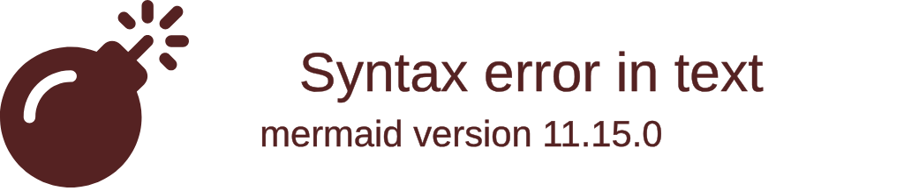
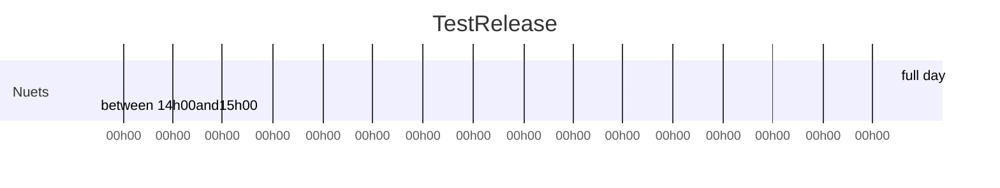
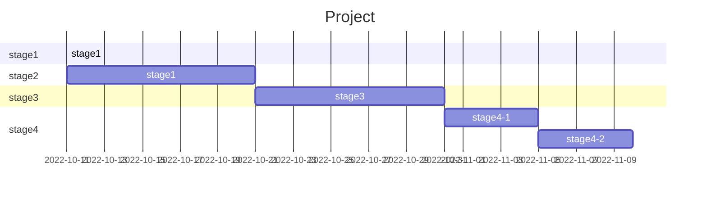
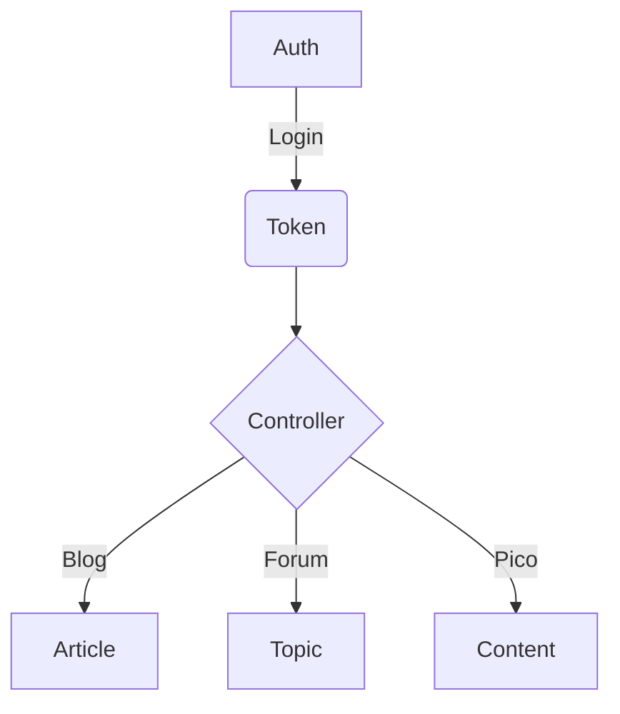

#### Understanding the GitHub flow

GitHub Flow is a lightweight, branch-based workflow that supports teams and projects where deployments are made regularly. This guide explains how and why GitHub Flow works.


 [5 minute read](https://guides.github.com/introduction/flow/)
 Download PDF version


### gitGraph



## Task list

- [ ] a bigger project
  - [x] first subtask
  - [x] follow-up subtask
  - [ ] final subtask
- [ ] a separate task

# Commit Message Emoji 👋

Every commit is important.
So let's celebrate each and every commit with a corresponding emoji! 😄

Oh, and it can also help with glancing over commit messages to figure out
what kind of changes have been made. 😏

## Usage

Prepend every commit message with an emoji with this form:
`<emoji> commit message`.

For commits with multiple types of messages, use multiple lines:
```
<emoji> commit message
<emoji2> commit message2
```

## Which Emoji to Use? ❓

Commit Type | Emoji | Reference
----------  | -----
Initial Commit |  🎉 | [Party Popper](http://emojipedia.org/party-popper/)
Version Tag | 🔖 |  [Bookmark](http://emojipedia.org/bookmark/)
New Feature | ✨ |  [Sparkles](http://emojipedia.org/sparkles/)
Bugfix | 🐛 |  [Bug](http://emojipedia.org/bug/)
Security Fix | 🔒 |  [Lock](https://emojipedia.org/lock/)
Metadata | 📇 |  [Card Index](http://emojipedia.org/card-index/)
Refactoring | ♻ |  [Black Universal Recycling Symbol](http://emojipedia.org/black-universal-recycling-symbol/)
Documentation | 📚 |  [Books](http://emojipedia.org/books/)
Internationalization | 🌐 |  [Globe With Meridians](http://emojipedia.org/globe-with-meridians/)
Accessibility | ♿ |  [Wheelchair](https://emojipedia.org/wheelchair-symbol/)
Performance | 🐎 |  [Horse](http://emojipedia.org/horse/)
Cosmetic | 🎨 |  [Artist Palette](http://emojipedia.org/artist-palette/)
Tooling | 🔧 |  [Wrench](http://emojipedia.org/wrench/)
Tests | 🚨 |  [Police Cars Revolving Light](http://emojipedia.org/police-cars-revolving-light/)
Deprecation | 💩 |  [Pile of Poo](http://emojipedia.org/pile-of-poo/)
Removal | 🗑 |  [Wastebasket](http://emojipedia.org/wastebasket/)
Work In Progress (WIP) | 🚧 |  [Construction Sign](http://emojipedia.org/construction-sign/)


## Emoji Integration

There are various ways to make inserting emojis easier.
Here are to more easily integrate emoji into your workflow.

## OSX

You can pull up the emoji keyboard by hitting <kbd>ctrl</kbd>+<kbd>⌘</kbd>+<kbd>space</kbd>

## Windows 10

You can pull up the emoji keyboard by hitting <kbd>Win</kbd>+<kbd>.</kbd>

## Gnome Shell

You can show a list of emoji to copy to your system clipboard using the [Emoji Selector](https://extensions.gnome.org/extension/1162/emoji-selector/) Gnome extension.

## Atom Editor

Install package for [autocomplete-emojis](https://atom.io/packages/autocomplete-emojis).
In the package settings, check the box for "Enable Unicode Emojis".

Atom can also help with using emoji in commit message by installing [git-plus](https://atom.io/packages/git-plus)

## Sublime Text

Install package for [GithubEmoji](https://github.com/akatopo/GithubEmoji).

## Vim 

Install package for [Vim-emoji](https://github.com/junegunn/vim-emoji#installation).

Add `set completefunc=emoji#complete` to `.vimrc` and then run emoji completion with `CTRL-X CTRL-U`

## npm

Create an `.npmrc` [file](https://docs.npmjs.com/files/npmrc) and set the `message` value.
```ini
message = "🔖 %s"
```

## Emacs

Install [emoji-cheat-sheet-plus](https://github.com/syl20bnr/emacs-emoji-cheat-sheet-plus).

Bring up the emoji buffer with:

```
M-x emoji-cheat-sheet-plus-insert
```

## Embed

Use markdown files to include samples.

```
[filename](../../_media/exemple.md ':include :type=code')
```

[filename](../../_media/exemple.md ':include :type=code')


## Graph


### Line Chart



# Gant



## Connections

Rounded connections. To enable this for a flow chart without access to the Mermaid object (i.e. in a markdown document) use linkStyle default interpolate basis.



<script>
var callback = function(){
    alert('A callback was triggered');
}
<script>