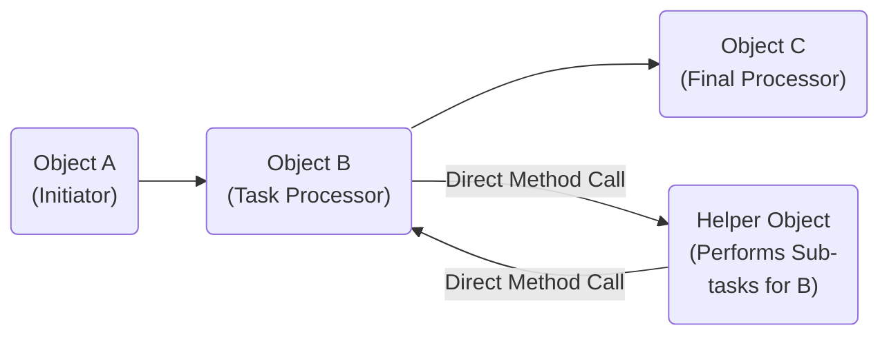
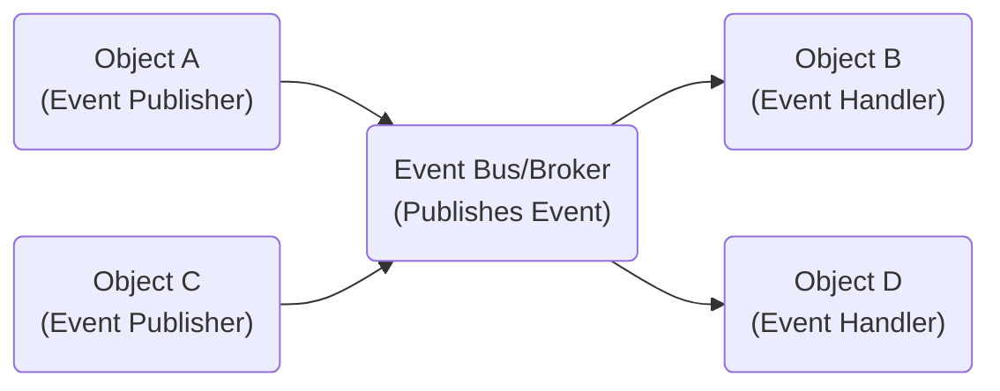
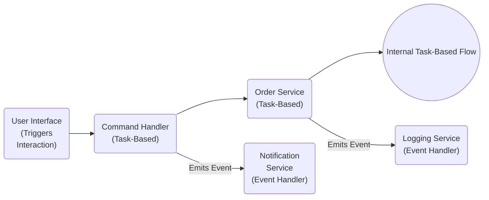

**XCube Core Design Philosophy: Minimalism and Flexibility**

At its core, XCube's minimalism focuses on intentionality: eliminating the superfluous to achieve meaningful simplicity. While the XCube core incorporates established Design Patterns recognized as best practices by experienced object-oriented software developers, its design also draws inspiration from traditional mechanisms beyond the web. Concepts such as preloading, delegates, task systems, and a generic render-sequence (inspired by .NET and video-game programming) were adopted to implement an ideal specification.

  

XCube design was crucial for developing a modular architecture, empowering web developers and designers to utilize their preferred frameworks and libraries.  

Consequently, the underlying logic of the core main classes – what the project team termed the "Core program" – is built upon a simple "No Framework" or framework-agnostic design concept, leveraging an event-driven approach for extensibility.

The XCube core was developed from scratch by Kazuhisa Minato (lead programmer in the game industry),
addressing the challenges of software development for current and future parallel hardware architectures
which are now dominated by multicore architectures. 

The XCube concept mediates between existing computing resources and applications on the one hand,
and the high-level goals required for personalization at scale on the other. Thus implementing a 
program execution with backward compatibility and the complementary concept of forward compatibility.

In a slide deck (wiki), Kazuhisa Minato depicts the developed architecture to support these new capabilities.
He also described some software engineering challenges that arise in this context.
The key features of the new architecture are :

- the ability to interface with existing applications, while adding considerable support for tasks;
- the ability to incorporate other base systems so that the web platform adapts over time;
- and the ability to cope with resource variability and mobility.

* Self-initialization
* Drive mechanism
* Rendering sequence

Learn more : [XCube Core](/en/development/xcube-core.md)

## XCube Design

XCube design shares commonalities with widely used design patterns found in modern programming languages like Java and C#. Design patterns represent well-established solutions to recurring problems in software design. Many of these patterns are language-agnostic and aim to promote principles like:

- Modularity: Breaking down complex systems into smaller, independent units.
- Reusability: Designing components that can be used in different parts of the system or in other projects.
- Maintainability: Creating code that is easier to understand, modify, and debug.
- Flexibility: Allowing the system to adapt to changing requirements.

Given that XCube has a modular architecture and emphasizes concepts like separation of concerns and extensibility, it would naturally align with many of these fundamental design principles that are also prevalent in Java and C# development. Common patterns you might find similarities with include:

- Model-View-Controller (MVC): For separating application logic, user interface, and data.
- Factory Pattern: For creating objects without specifying the exact class to be instantiated.
- Strategy Pattern: For defining a family of algorithms and making them interchangeable.
- Observer Pattern: For defining a one-to-many dependency between objects.
- Dependency Injection: For reducing coupling between components.

While the specific implementation details might differ due to PHP's unique features and conventions, the underlying design principles and the problems XCube aims to solve are likely to resonate with the solutions embodied in common Java and C# design patterns. Some advantages of XCube design:
 
- inheritance, as object creation is delegated to subclasses,
- it promotes consistency, classes are made to be polymorphic, thus interchangeable;
- benefit from type-safe code than before;
- since most objects are exchangeable, it's possible to change the layer (base system), not only managers.

?> **NOTE** XOOPSCube Legacy does follow an event-driven architecture and implements aspects of a task-based view of application software. While not strictly a parallel programming methodology in the traditional sense, its design reflects solutions to common issues that only later became available as standards, such as those in PHP.

**A parallel programming methodology exploiting a task-based view of application software 
and event-driven architecture.**

These two approaches are different in their fundamental control flow and interaction paradigms,  
but they are not mutually exclusive and can be highly complementary in OOP systems:

- Levels of Abstraction  
  An application might use an event-driven architecture at a higher level for inter-module communication or handling user interactions, while individual modules internally use a task-based approach to execute specific operations triggered by those events.

- Combining Paradigms  
  Objects can both perform tasks (have methods that are called directly) and emit/listen for events. For example, a "Order" object might have a processPayment() task and also emit an "OrderPaid" event upon successful completion.

- Decoupling and Orchestration  
  Event-driven architectures excel at decoupling components, making systems more flexible and scalable. However, the handlers that react to events often perform specific tasks, bringing the task-based approach into play. An orchestrator component might listen to several events and then trigger a sequence of tasks in response. 
    
- UI Development  
  Event-driven programming is dominant in GUI development (handling button clicks, mouse movements), where events trigger specific task-oriented functions within the application logic.   
  

Task-based programming models with static or dynamic task creation was a main topic discussed by Minahito,
core programmer, and the prominent developers then. Mainly because the mainstream web programming model,
or web development trend was, and still largely sequential and sort of von Neumann oriented.
Also, because sophisticated programming techniques were required to access the parallel resources available
(e.g. XCube Service). Therefore, a change in developers mindset, about programming and software development,
was imperative for making the capabilities of the new XCube core available to web developers with various skills
to create and release new subsystems architectures.

**Task-Based Architecture**

- Focuses on defining and executing specific, discrete units of work or procedures (tasks).
- The program flow is often linear or follows a directed sequence of task execution.
- Components typically interact through direct method calls, where one object invokes a method on another to perform a specific action.
- Emphasis is on achieving a particular goal through a series of steps.
- Think of it like a recipe: follow the steps in order to get the final dish.

**Event-Driven Architecture**

- Centers around the production and consumption of events, which signify a change in state or a significant occurrence.   
- Components are decoupled and communicate indirectly by emitting and subscribing to events.   
- When an event occurs, interested components (subscribers or listeners) react to it.   
- The program flow is more reactive and less rigidly defined, driven by the occurrence of events.   
- Think of it like a notification system: when something happens, those who are interested are notified and can take action.   

**Difference or Complementary**

**Why a dual-system with a dual render was needed?**

While task-based architecture emphasizes direct method calls and sequential execution of operations, event-driven architecture focuses on asynchronous communication and reactive behavior based on events. In OOP, these are often complementary strategies used at different levels or in different parts of an application to achieve modularity, responsiveness, and effective handling of both internal operations and external interactions. The choice of which approach dominates depends on the specific requirements and complexity of the system being built.

> In the 3D application world, there are many "controversies" around the question of the best process.   
> For example, the scene management has multiple solutions — Octree, Quadtree, Terrain, Sphere tree, no tree and more...
> but all these controversies are useless, because the best process is determined by what the application has to do.  
> — Kazuhisa Minato

A web application has commonly the same "controversies" about required features.

XCube delegates to managers and controllers. So developers are free to change them according to their needs.
Thus, it's a must-have for flexibility. However, XCube also benefits from another _side effect_ of this mechanism.

The singleton design pattern is well-known to solve recurring design problems of reusable
object-oriented software. It can be used to reduce memory usage and can also be used as a basis for
other design patterns, such as the abstract factory, factory method, builder, and prototype patterns.

## XCube Base System

The XOOPSCube Team released the _Base Legacy System_ before XCube 1.0 was completed by Kazuhisa Minato as the first
XCube major version. Therefore, the package Legacy implements many features to emulate Xoops2 system.
So the _Base System Legacy_ is an exception, made by highly skilled developers and high experimented designers
to ensure backwards compatibility and interoperability with XOOPS2 (©2002 Kazumi Ono @Onokazu, GPL2)
and later XOOPS2-JP (©2005 XOOPS2 Japan, GPL2) Japanese versions with multibyte character support.

The _Base System Legacy_ main functions have been placed into their own modules, such as user group management,
private messages, render engine, and standard cache.

**Exchangeable**

The _Base System_ is designed to be replaceable or entirely rewritten, empowering developers to create anything, anytime, anywhere.

However, the core itself – the very mechanism that enables this "exchangeability" and ensures scalability, flexibility, and freedom – remains intentionally immutable.

## XCube Namespace

XCube used a prefix convention to implement the concept of namespace when PHP didn't provide any.  
_PHP namespaces were introduced in PHP 5.3, and subsequently updated._

In the PHP world, namespaces are designed to solve two problems that authors of libraries and
applications encounter when creating re-usable code elements such as classes or functions:
Name collisions between code you create, and internal PHP classes, functions, constants or
third-party classes, functions and constants.

Key points regarding XCube's approach to class naming and autoloading:

* **PSR-0 Style:** XCube's naming convention, with PascalCase class names and underscores acting as directory separators in the filename (e.g., XCube_ActionFilter.class.php for a class conceptually under a XCube\_ActionFilter "namespace"), was in the principles later formalized in **PSR-0 (Autoloading Standard)**. PSR-0, while now deprecated in favor of PSR-4, was an early standard for autoloading in PHP that mapped class namespaces to file system paths.  
* **"Namespace Before Namespaces":** The underscore-based directory structure in XCube effectively served as a rudimentary form of namespacing *before* PHP had native namespace support (which was introduced in PHP 5.3). This convention helped to prevent class name collisions in large projects.  
* **Autoloader:** The example of XCube_ActionFilter.class.php indicates that XCube had its own autoloader implementation.  
This autoloader been responsible for translating the class name into a file path based on the underscore convention, and including the file when the class was first used.

**What is the standard in modern PHP?**

The current standard for class naming and autoloading in PHP is defined by **PSR-4 (Improved Autoloading)**. Here's a summary of the key differences and the modern standard:

**PSR-4 Standard:**

* **Namespaces:** PSR-4 relies on PHP's native namespace system (introduced in PHP 5.3). Class names are fully qualified with namespaces (e.g., \\Vendor\\Package\\ClassName).  
* **PascalCase for Class Names:** Class names themselves MUST be in PascalCase (also known as StudlyCaps), where each word in the class name starts with a capital letter (e.g., MyClassName, UserProfile).  
* **Mapping Namespaces to Directories:** PSR-4 defines a direct mapping from namespaces to directory structures. The namespace separators (\\) are directly translated to directory separators (/ on most systems). A base directory is configured for each namespace prefix.  
* **No Special Meaning for Underscores in Class Names:** Unlike XCube's convention and PSR-0's handling, underscores within the class name itself do *not* have a special meaning in PSR-4 and are not automatically converted to directory separators. If you have a class named My\_Class, the file would typically be My\_Class.php within the appropriate namespace directory.  
* **Composer:** PSR-4 is the autoloading standard adopted by Composer, the widely used dependency manager for PHP. Composer's autoloader makes it easy to manage and load classes following PSR-4 conventions.

**Comparison:**

| Feature | XCube (Pre-Namespace) / PSR-0 Style | Modern PHP (PSR-4) |
| :---- | :---- | :---- |
| **Namespaces** | Underscores in class names/filenames | Native PHP namespaces (\\) |
| **Class Casing** | PascalCase | PascalCase |
| **Directory Mapping** | Underscores often to / | Namespace separators (\\) to / |
| **Underscore Meaning** | Acts as directory separator | No special meaning in class name |
| **Autoloading** | Custom implementation | Primarily Composer's autoloader (PSR-4) |

**In summary:**

XCube's approach was a common and sensible way to handle class organization and autoloading before native PHP namespaces became available. It shares similarities with the now-deprecated PSR-0 standard.

Modern PHP development overwhelmingly follows the **PSR-4 standard** for class naming and autoloading, leveraging native namespaces and Composer for dependency management and autoloading. While you might still encounter legacy systems using PSR-0 conventions, new projects should adhere to PSR-4 for better interoperability and alignment with the current PHP ecosystem.

?> **NOTE** XCube's extensible architecture, designed for separation of concerns and namespaces, simplifies running Composer – the PHP dependency manager providing a standard format for managing dependencies and required libraries – automatically bootstrapping its installations in the appropriate vendor folder under 'trust_path/vendor'.

## Delegate manager

XCube starts up managers from the configuration settings written into the file `default.ini`
or override with a simple file `custom.ini`

XCube consists of several managers and each manager provides careful management of its members and a consistent API.
Developers can choose from managers, modules, delegate and preload system for extensible and flexible
customization.

Some distribution packages have been released with a well-configured starting INI file and a set of base modules to facilitate rapid site development. Allowing web developers to use a pre-configured bundled package as a starting point that meets the production expectations.

## Preload

A Preload is a single-file component, an extension for customization and personalization of a website,
so Webmasters don't have to change the source code of the trusted system.

- A delegate is a mechanism to delegate part of the processing to another program.
- A preload is a mechanism to perform preprocessing before the module is executed.

Delegate and preload are essentially different mechanisms and can be used independently.  

In practice, you an run several **Single File Components**, or one-file hacks, using the delegate   
in a **preload** to modify the processing and behavior of modules.

## Type Safe

Among other things, XCube has some policies and features to ensure security.  
One of these policies is the safe type-safe emulation.

## Action Form

This class retrieves input values from the request using the current context object and then validates them.
It cleanly separates the data fetching and validation processes from your core application logic.
Such a class is crucial in web programming.

## Virtual Service

XCube provides a server-client model for module and site communication.
The virtual service abstracts the actual program, so the client can connect with a module, and from another website.

## Render Engine

XCube defines the render-system class as an interface which renders html data from various template-formats.
XCube core handles render buffer instances as output data. The Render system writes the html data.

Common render systems are registered in the Root. However, it's not a good solution if the render system is only
used by a single module. So a custom render system shouldn't need to be registered to the root, instead the render
system should be a sub-class of the XCube layer. If the class doesn't depend on modules, it can be re-used.

This mechanism means that XCube doesn't enforce a template format nor impose any to developers and designers.  
XCube allows you to develop your own template engine or run the default Smarty render engine.

+ Module developers can develop their own render system.
+ Designers can create new themes formats.

## Multi-Render

XCube doesn't have a fixed specification for themes and templates.
The Generic Render-Sequence enables rendering the final output by switching render systems. T
This allows complete control over a finished custom design using your preferred framework.

## Framework Agnostic

Support for modern JavaScript frameworks (compiled reactjs, vue, fluent, etc.) and easily integration of CSS Frameworks.

## Standard Cache

XCube has introduced a new caching policy concept called Standard Cache. This component manages the standard caching 
policy of the web application platform. It is a module of the Legacy subsystem whose purpose is to reduce the time 
required to execute certain processes by caching module and block templates. 

The caching function saves the content to temporary files — if the caching parameter is active, and if the cache files 
are available — it prevents overloading the server with further SQL queries.
This is a useful and powerful feature that speeds up the loading of a web page for all users of the site.

?> **NOTE** : The standard policy is to cache files for all user groups except the webmaster group.

## Trust Path

The TRUST PATH concept was introduced by @Gijoe from Peak.ne.jp (based on Minahito’s idea as GijoeI credited).
It aims to secure subsystem modules by moving all module PHP files out of public _web root_ or
server _document_root_ (e.g. public_html) to make it private and safe.

The second benefit of using TRUST PATH is that D3 modules duplication become easily manageable.
With the introduction of a trusted source and duplicable modules, or Duplicable V3/D3,
webmasters are free to duplicate and rename installed D3 modules.

?> **Tip** The folder **TRUST_PATH** can be renamed to whatever name you wish.

## XCube Modules

The Module System is the core extensibility mechanism in XOOPSCube Legacy (XCL) that allows developers to add new functionality to the platform through modular components.

