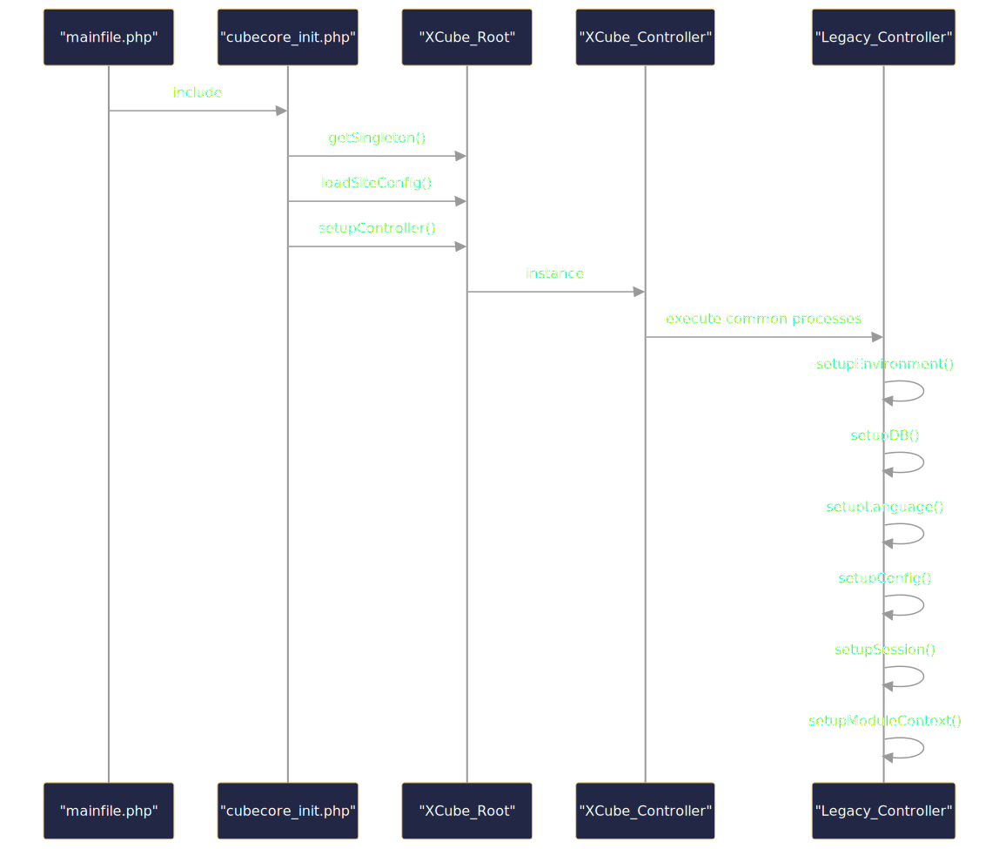

The minimalist XCube core, located within the `html/core` directory, serves as the foundational layer for the XOOPS Cube Legacy application. 
Its primary function is to bootstrap the system and handle the initial web request lifecycle. Key features include:

- Basic Autoloading: Mechanisms for automatically loading necessary PHP classes, enabling a modular code structure.
- Request Handling: Core components to receive and process incoming HTTP requests.
- Basic Class Registry: A system for managing and accessing core objects and services.
- Initialization Routines: Essential scripts to set up the environment, including path definitions and basic configuration loading.

### Visualize the minimal XCube core 

While the schema appears relatively simple due to the limited number of files and their apparent roles, revealing the overall structure, it doesn't effectively illustrate the complexity of the main flow and its dependencies :)


## XCube Bootstrap Process

The XCL (XOOPS Cube Legacy) bootstrap process is a sophisticated sequence that loads the core framework,  
initializes the rendering system, and outputs the final theme.

XOOPSCube Legacy initialization begins with loading the `mainfile.php` as the entry point, which then includes `cubecore_init.php`. This initializes the `XCube_Root` singleton, loads site configuration, and sets up the controller.

<p align="center">

</p>

**The initialization sequence follows these steps:**

1. `mainfile.php` includes `cubecore_init.php`
2. `cubecore_init.php` gets the `XCube_Root` singleton instance
3. Site configuration is loaded from INI files
4. The controller is set up based on configuration
5. The `Legacy_Controller` (extending XCube_Controller) prepares the environment
6. Common initialization tasks are executed through `executeCommon()`

<span class="iconify" data-icon="mdi:github"></span> Sources: <code><a href="https://github.com/xoopscube/legacy/blob/7f33bc98/html/include/cubecore_init.php#L31-L54" target="_blank">cubecore_init.php#L31-L54</a></code> <code><a href="https://github.com/xoopscube/legacy/blob/7f33bc98/html/modules/legacy/kernel/Legacy_Controller.class.php#L186-L235" target="_blank">Legacy_Controller.class.php#L186-L235</a></code>


## 1. Initialization

The process begins with `mainfile.php`, which serves as the entry point for all requests:

- Define constants and paths
- Root path (public) 
- Trust path (private) 
- URL
- etc.

And requires:

- Load protector (security module) pre-check
- Initialize cubecore
- Load common functionality if not prevented
- Load protector post-check

## 2. Core Initialization 

`cubecore_init.php` loads the core classes and initializes the configuration system:

- XCL version constants
- XCube_Root class
- XCube_Controller class
- IniHandler class

Defined configuration file paths  
- Default settings : site_default.ini
- XCUBE_SITE_CUSTOM_FILE settings : site_custom.ini

## 3. Loading Definitions 

The system loads `definition.inc.php` which contains essential constants:

- Block positions
- Path definitions
  - CACHE PATH
  - MODULE PATH
- Render system definition
  - Legacy_RenderSystem

## 4. Configuration Loading 

The system reads `site_default.ini` to configure components:

```ini
[Cube]
Root=XOOPS_ROOT_PATH
Controller=Legacy_Controller
SystemModules=legacy,legacyRender,user,profile,stdCache,altsys,message,protector
// ...

[RenderSystems]
Legacy_RenderSystem=Legacy_RenderSystem
Legacy_AdminRenderSystem=Legacy_AdminRenderSystem
// ...

[Legacy_RenderSystem]
path=/modules/legacyRender/kernel
class=Legacy_RenderSystem
// ...
```

#### Environment Settings

The ini file of XOOPSCube follows an inheritance pattern  
and are loaded in the following order:

1. site_default.ini
2. site_default.dist.ini
3. site_custom.ini
4. site_custom_ {XOOPS_SALT} .ini

The value read earlier is overwritten with the later setting.

#### Get the value set in site_default.ini and site_custom.ini

```
    $root = XCube_Root :: getSingleton ();  
    $value = $root-> getSiteConfig ('section name','parameter name'));
``` 

Example : site_custom.ini

```php 
    [Foo]    
    Bar = Baz    
    $root  =  XCube_Root :: getSingleton ();    
    $value  =  $root-> getSiteConfig ( 'Foo' , 'Bar' );    
    echo  $value ;    
    // Output is Baz
```

?> **Note** `trust_path/settings/site_custom.ini` **overwrites** `trust_path/settings/site_default.ini`


## 5. Controller Initialization

The `Legacy_Controller` is initialized based on the configuration:

```php
// In Legacy_Controller.class.php
class Legacy_Controller extends XCube_Controller
{
    // Initialize modules, services, and context
    public function __construct()
    {
        parent::__construct();
        $this->_mStrategy = new Legacy_PublicControllerStrategy($this);
        // ...
    }
    
    // Execute the request
    public function execute()
    {
        // Process blocks, modules, and render the page
        // ...
    }
}
```

## 6. Render System Initialization

The Legacy_RenderSystem is loaded to handle the rendering process:

```php
// In Legacy_RenderSystem.class.php
class Legacy_RenderSystem extends XCube_RenderSystem
{
    // Initialize Smarty and template system
    public function __construct()
    {
        parent::__construct();
        // ...
    }
    
    // Create render targets for different parts of the page
    public function createRenderTarget($type = null)
    {
        // Create theme, block, or main content render targets
        // ...
    }
    
    // Render the page
    public function render(&$target)
    {
        // Process templates and output HTML
        // ...
    }
}
```

## 7. Template Processing

The system uses **Smarty** for template processing:

```php
// In Legacy_RenderSystem.class.php
function render(&$target)
{
    // Initialize Smarty template engine
    $smarty = new XoopsTpl();
    
    // Set template variables
    foreach ($target->getAttributes() as $key => $value) {
        $smarty->assign($key, $value);
    }
    
    // Process the template
    $result = $smarty->fetch($target->getTemplateName());
    
    // Set the result
    $target->setResult($result);
}
```

## 8. Final Output

The final output process combines all rendered components:

1. The main content is rendered by the module's action
2. Blocks are rendered and positioned according to their settings
3. The theme template (theme.html) is loaded and populated with content
4. The complete HTML is sent to the browser

## Flow Summary

1. `mainfile.php` → Sets up environment and loads core
2. `cubecore_init.php` → Initializes XCube core classes
3. `definition.inc.php` → Defines constants and paths
4. `site_default.ini` → Configures components and modules
5. `Legacy_Controller` → Processes the request
6. `Legacy_RenderSystem` → Handles template rendering
7. Smarty → Processes templates
8. Theme output → Final HTML sent to browser

This architecture allows XCL to maintain a clean separation between content,  
presentation, and logic while providing a flexible framework for module development.