## XCube Delegate

The XCube_Delegate System is a core component of XOOPSCube Legacy that enables extensibility through a flexible callback mechanism. This system allows modules, themes, and plugins to modify or extend the framework's behavior without directly modifying core code. The delegate system implements a variation of the Observer pattern that facilitates loose coupling between components.

This page documents the structure and functionality of the XCube_Delegate System. For information about the overall controller architecture, see Legacy_Controller and Request Lifecycle.

Architecture Overview
Sources
https://github.com/xoopscube/legacy/blob/7f33bc98/html/core/XCube_Delegate.class.php#L1-L709
https://github.com/xoopscube/legacy/blob/7f33bc98/html/core/XCube_Root.class.php#L1-L549


### Core Components

#### XCube_Ref

A simple adapter class that solves the problem of passing variables by reference to delegate callbacks. Since PHP4, functions receive copied values of objects, but using XCube_Ref allows functions to receive the actual object.

When a delegate call needs to modify a parameter, wrapping it in XCube_Ref ensures the changes are reflected outside the callback:

```php
// Instead of:
$delegate->call($object); // object is copied, changes don't persist

// Use:
$delegate->call(new XCube_Ref($object)); // changes to object will persist
```
Sources: https://github.com/xoopscube/legacy/blob/7f33bc98/html/core/XCube_Delegate.class.php#L31-L59


### XCube_Delegate

The primary class that implements the delegate pattern. This class maintains a list of callback functions and executes them when called. It supports parameter type checking and priority-based execution order.

Key features:

- Supports parameter signature validation
- Callbacks can be registered with priorities (1-10)
- Supports lazy registration when delegate manager isn't ready
- Can load files on demand when executing callbacks
- Callbacks can break the execution chain by returning `XCUBE_DELEGATE_CHAIN_BREAK`

#### XCube_DelegateManager

Manages delegate registrations and acts as a mediator between delegates and callback functions. This class handles the case where callbacks are registered before their target delegates exist.

The manager maintains these internal structures:

_mDelegates: A map of registered delegates indexed by name
_mCallbacks: Callbacks waiting to be connected to not-yet-registered delegates
_mCallbackParameters: Parameters for pending callbacks

Sources: 
https://github.com/xoopscube/legacy/blob/7f33bc98/html/core/XCube_Delegate.class.php#L388-L541


#### XCube_DelegateUtils

A utility class that provides static convenience methods for working with delegates. It simplifies common delegate operations with shorthand methods.

These utility methods make it easier to work with delegates without directly accessing the delegate manager:

- `call()`: Calls a delegate by name
- `raiseEvent()`: Alias for call(), used for event-style delegates
- `applyStringFilter()`: Special case for applying string filters

source: https://github.com/xoopscube/legacy/blob/7f33bc98/html/core/XCube_Delegate.class.php#L543-L708

#### Integration with XCube_Root

The delegate system is integrated with the core framework through XCube_Root, which serves as the central registry for the application.

{media}

Sources:
https://github.com/xoopscube/legacy/blob/7f33bc98/html/core/XCube_Root.class.php#L48-L50
https://github.com/xoopscube/legacy/blob/7f33bc98/html/core/XCube_Root.class.php#L325-L337
https://github.com/xoopscube/legacy/blob/7f33bc98/html/core/XCube_Controller.class.php#L137-L142

#### Priority System

The delegate system includes a priority mechanism that controls the order in which callbacks are executed. Predefined constants are provided for common priority levels:

<table><thead><tr><th>Constant</th><th>Value</th><th>Purpose</th></tr></thead><tbody><tr><td>XCUBE_DELEGATE_PRIORITY_FIRST</td><td>10</td><td>Callbacks that need to run first</td></tr><tr><td>XCUBE_DELEGATE_PRIORITY_NORMAL</td><td>50</td><td>Default priority level</td></tr><tr><td>XCUBE_DELEGATE_PRIORITY_FINAL</td><td>100</td><td>Callbacks that need to run last</td></tr><tr><td>XCUBE_DELEGATE_PRIORITY_1-10</td><td>10-100</td><td>Fine-grained priorities</td></tr></tbody></table>

When callbacks are registered with the same priority, they execute in the order they were registered.

<p>Sources: <a href="https://github.com/xoopscube/legacy/blob/7f33bc98/html/core/XCube_Delegate.class.php#L66-L79" target="_blank">
https://github.com/xoopscube/legacy/blob/7f33bc98/html/core/XCube_Controller.class.php#L138-L139<span class="flex flex-shrink-0 items-center rounded-r border-l px-2 py-1.5 border-[#dddddd] bg-[#d8d8d8] text-[#666666] dark:border-[#333333] dark:bg-[#2a2a2a] dark:text-[#888888]">66-79</span></a></p>

<p><svg xmlns="http://www.w3.org/2000/svg" width="18" height="18" style="vertical-align: -0.125em;" viewBox="0 0 24 24"><path fill="currentColor" d="M12 2A10 10 0 0 0 2 12c0 4.42 2.87 8.17 6.84 9.5c.5.08.66-.23.66-.5v-1.69c-2.77.6-3.36-1.34-3.36-1.34c-.46-1.16-1.11-1.47-1.11-1.47c-.91-.62.07-.6.07-.6c1 .07 1.53 1.03 1.53 1.03c.87 1.52 2.34 1.07 2.91.83c.09-.65.35-1.09.63-1.34c-2.22-.25-4.55-1.11-4.55-4.92c0-1.11.38-2 1.03-2.71c-.1-.25-.45-1.29.1-2.64c0 0 .84-.27 2.75 1.02c.79-.22 1.65-.33 2.5-.33s1.71.11 2.5.33c1.91-1.29 2.75-1.02 2.75-1.02c.55 1.35.2 2.39.1 2.64c.65.71 1.03 1.6 1.03 2.71c0 3.82-2.34 4.66-4.57 4.91c.36.31.69.92.69 1.85V21c0 .27.16.59.67.5C19.14 20.16 22 16.42 22 12A10 10 0 0 0 12 2"></path></svg></p>
<div></div>