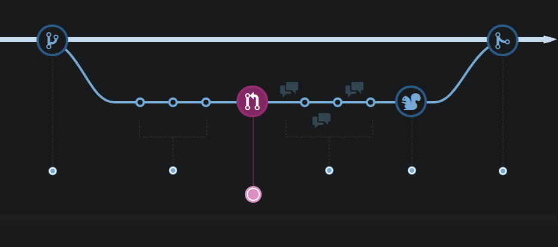
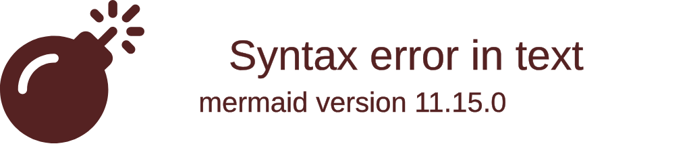
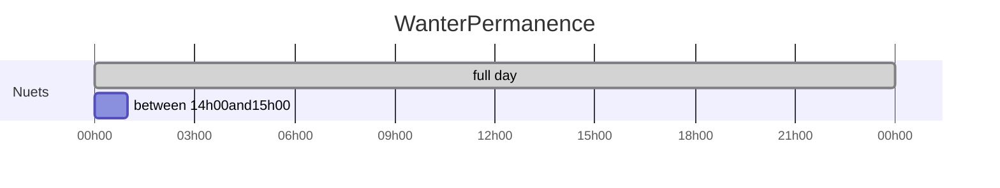
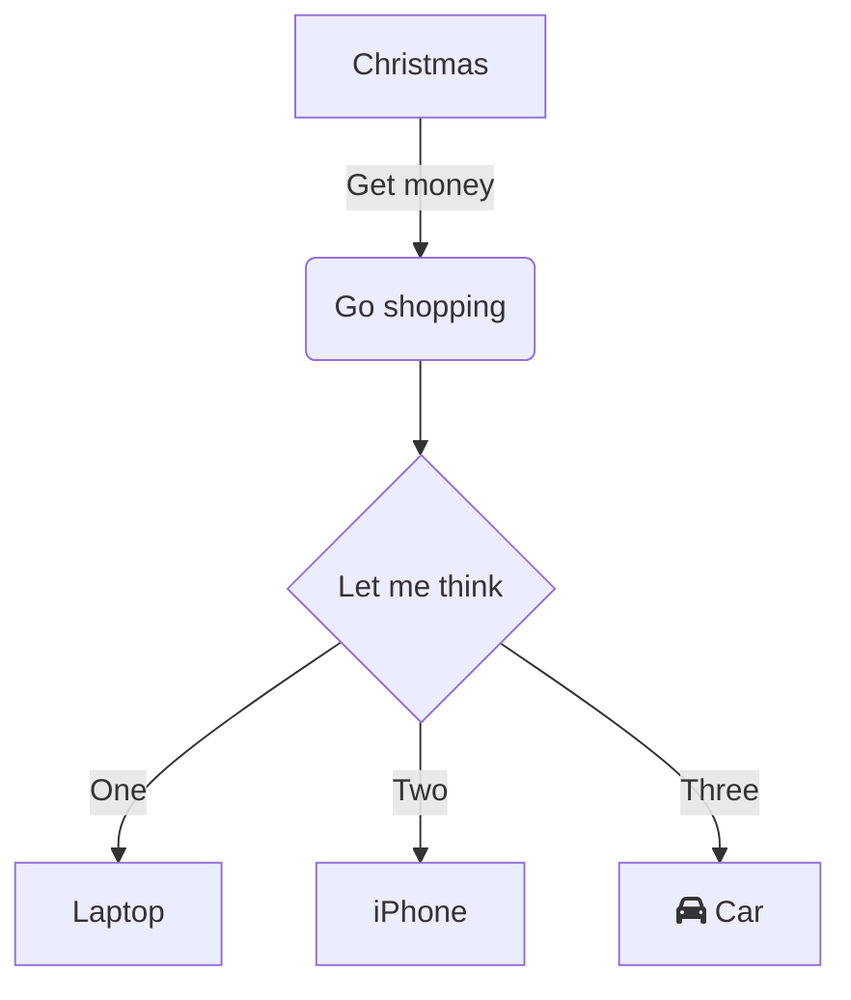
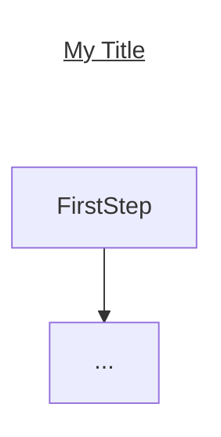
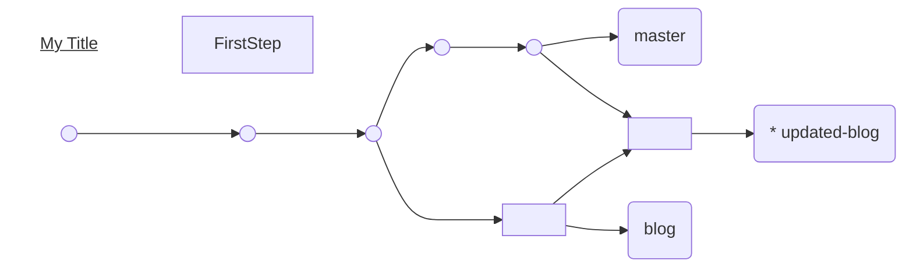

#### Understanding the GitHub flow

GitHub Flow is a lightweight, branch-based workflow that supports teams and projects where deployments are made regularly. This guide explains how and why GitHub Flow works.



 [5 minute read](https://guides.github.com/introduction/flow/)
 Download PDF version


### gitGraph




## Task list

- [ ] a bigger project
  - [x] first subtask
  - [x] follow-up subtask
  - [ ] final subtask
- [ ] a separate task

## embed

[filename](../../_media/exemple.md ':include :type=code')

## Tables and alignment

First Header | Second Header
------------ | -------------
Content from cell 1 | Content from cell 2
Content in the first column | Content in the second column

| Left-Aligned  | Center Aligned  | Right Aligned |
| :------------ |:---------------:| -----:|
| col 3 is      | some wordy text | $1600 |
| col 2 is      | centered        |   $12 |


### Line Chart



# test gant

```mermaid
 gantt
    dateFormat  YYYY-MM-DD
    title Project

    section stage1
    stage1 : stage1, 2017-04-06, 2017-06-06

    section stage2
    stage1 : stage2, after stage1, 20d

    section stage3
    stage3 : stage3, after stage2, 20d

    section stage4
    stage4-1 : stage4-1, after stage3, 90d
    stage4-2 : stage4-2, after stage4-1, 90d
    ```

## callback


```mermaid
graph LR;
    A-->B;
    click A callback "Tooltip for a callback"
    click B "http://www.github.com" "This is a tooltip for a link"
```

Rounded connections. To enable this for a flow chart without access to the Mermaid object (i.e. in a markdown document) use linkStyle default interpolate basis.



testing br

Here is a little workaround for adding a fake title to the top down flowchart (TD):

View in Mermaid Live Editor

https://mermaidjs.github.io/mermaid-live-editor

https://mermaidjs.github.io/gantt.html

http://gitgraphjs.com/



```mermaid
graph TD;

subgraph Line breaks <br /> don't work in <br /> Subgraphs
    inset[Line breaks <br />work in <br />Insets]
end

    inset-->A

  A(Line breaks<br />work in<br />rounded rec nodes)
  B{Line breaks <br />work in<br />decision nodes}
  C[Line breaks<br />work in<br /> rectangles]
  D((Line breaks <br />work in <br />circles))
  E>Line breaks <br />work in <br />flag nodes]


    A-->B
    B--yes-->C
    B--no-->E
    C-->D
 


style A fill:#ed6,stroke:#333,stroke-width:2px;
style B fill:#ed6,stroke:#333,stroke-width:2px;
style C fill:#ed6,stroke:#333,stroke-width:2px;
style D fill:#ed6,stroke:#333,stroke-width:2px;
style E fill:#ed6,stroke:#333,stroke-width:2px;
style inset fill:#ed6,stroke:#333,stroke-width:2px;
```

sample

```md
gantt
       dateFormat  YYYY-MM-DD
       title Adding GANTT diagram functionality to mermaid

       section A section
       Completed task            :done,    des1, 2014-01-06,2014-01-08
       Active task               :active,  des2, 2014-01-09, 3d
       Future task               :         des3, after des2, 5d
       Future task2              :         des4, after des3, 5d

       section Critical tasks
       Completed task in the critical line :crit, done, 2014-01-06,24h
       Implement parser and jison          :crit, done, after des1, 2d
       Create tests for parser             :crit, active, 3d
       Future task in critical line        :crit, 5d
       Create tests for renderer           :2d
       Add to mermaid                      :1d

       section Documentation
       Describe gantt syntax               :active, a1, after des1, 3d
       Add gantt diagram to demo page      :after a1  , 20h
       Add another diagram to demo page    :doc1, after a1  , 48h

       section Last section
       Describe gantt syntax               :after doc1, 3d
       Add gantt diagram to demo page      :20h
       Add another diagram to demo page    :48h
```

## Test 2


# commit-message-emoji

## Integrations

There are various ways to make inserting emojis easier.

## OSX

You can pull up the emoji keyboard by hitting <kbd>ctrl</kbd>+<kbd>⌘</kbd>+<kbd>space</kbd>

## Windows 10

You can pull up the emoji keyboard by hitting <kbd>Win</kbd>+<kbd>.</kbd>

## Gnome Shell

You can show a list of emoji to copy to your system clipboard using the [Emoji Selector](https://extensions.gnome.org/extension/1162/emoji-selector/) Gnome extension.

## Atom Editor

Install package for [autocomplete-emojis](https://atom.io/packages/autocomplete-emojis).
In the package settings, check the box for "Enable Unicode Emojis".

Atom can also help with using emoji in commit message by installing [git-plus](https://atom.io/packages/git-plus)

## Sublime Text

Install package for [GithubEmoji](https://github.com/akatopo/GithubEmoji).

## Vim 

Install package for [Vim-emoji](https://github.com/junegunn/vim-emoji#installation).

Add `set completefunc=emoji#complete` to `.vimrc` and then run emoji completion with `CTRL-X CTRL-U`

## npm

Create an `.npmrc` [file](https://docs.npmjs.com/files/npmrc) and set the `message` value.
```ini
message = "🔖 %s"
```

## Emacs

Install [emoji-cheat-sheet-plus](https://github.com/syl20bnr/emacs-emoji-cheat-sheet-plus).

Bring up the emoji buffer with:

```
M-x emoji-cheat-sheet-plus-insert
```

# Commit Message Emoji 👋

Every commit is important.
So let's celebrate each and every commit with a corresponding emoji! 😄

Oh, and it can also help with glancing over commit messages to figure out
what kind of changes have been made. 😏

## Usage

Prepend every commit message with an emoji with this form:
`<emoji> commit message`.

For commits with multiple types of messages, use multiple lines:
```
<emoji> commit message
<emoji2> commit message2
```

## Which Emoji to Use? ❓

Commit Type | Emoji
----------  | -----
Initial Commit | [🎉 Party Popper](http://emojipedia.org/party-popper/)
Version Tag | [🔖 Bookmark](http://emojipedia.org/bookmark/)
New Feature | [✨ Sparkles](http://emojipedia.org/sparkles/)
Bugfix | [🐛 Bug](http://emojipedia.org/bug/)
Security Fix | [🔒 Lock](https://emojipedia.org/lock/)
Metadata | [📇 Card Index](http://emojipedia.org/card-index/)
Refactoring | [♻️ Black Universal Recycling Symbol](http://emojipedia.org/black-universal-recycling-symbol/)
Documentation | [📚 Books](http://emojipedia.org/books/)
Internationalization | [🌐 Globe With Meridians](http://emojipedia.org/globe-with-meridians/)
Accessibility | [♿ Wheelchair](https://emojipedia.org/wheelchair-symbol/)
Performance | [🐎 Horse](http://emojipedia.org/horse/)
Cosmetic | [🎨 Artist Palette](http://emojipedia.org/artist-palette/)
Tooling | [🔧 Wrench](http://emojipedia.org/wrench/)
Tests | [🚨 Police Cars Revolving Light](http://emojipedia.org/police-cars-revolving-light/)
Deprecation | [💩 Pile of Poo](http://emojipedia.org/pile-of-poo/)
Removal | [🗑️ Wastebasket](http://emojipedia.org/wastebasket/)
Work In Progress (WIP) | [🚧 Construction Sign](http://emojipedia.org/construction-sign/)

## Using Emoji is Hard! 😡

Here are [some ways](INTEGRATIONS.md) to more easily integrate emoji into your workflow.

## Comparison

You can be the judge on which is easier to grok.

Example taken from [here](https://github.com/dannyfritz/funcdash/commits/master)

### Commits Without Emoji 😧

0.5.2

Fix exporting of the library to include _.ifElse

0.5.1

add _.ifElse to README.md

0.5.0

add _.ifElse

fix JSDoc comment for _.call

Fix _.not documentation example.

Update JSDoc comments.

0.4.1

Update links to documentation.

Fix documentation.

Link to documentation pages.

0.4.0

Added a curried version of the mixin for lodash-fp.

Switch from lodash to lodash-compat

Add shields to README.

Add missing methods to index.js.

### Commits with Emoji 😃

🔖 0.5.2

🐛 Fix exporting of the library to include _.ifElse

🔖 0.5.1

📚 add _.ifElse to README.md

🔖 0.5.0

✨ add _.ifElse

📚 fix JSDoc comment for _.call

📚 Fix _.not documentation example.

📚 Update JSDoc comments.

🔖 0.4.1

📚 Update links to documentation.

📚 Fix documentation.

📚 Link to documentation pages.

🔖 0.4.0

✨ Added a curried version of the mixin for lodash-fp.

📇 Switch from lodash to lodash-compat

📇 Add shields to README.

🐛 Add missing methods to index.js.


Inspired by [dannyfritz/commit-message-emoji](https://github.com/dannyfritz/commit-message-emoji)

See also [gitmoji](https://gitmoji.carloscuesta.me/).

|   Commit type              | Emoji                                         |
|:---------------------------|:----------------------------------------------|
| Initial commit             | :tada: `:tada:`                               |
| Version tag                | :bookmark: `:bookmark:`                       |
| New feature                | :sparkles: `:sparkles:`                       |
| Bugfix                     | :bug: `:bug:`                                 |
| Metadata                   | :card_index: `:card_index:`                   |
| Documentation              | :books: `:books:`                             |
| Documenting source code    | :bulb: `:bulb:`                               |
| Performance                | :racehorse: `:racehorse:`                     |
| Cosmetic                   | :lipstick: `:lipstick:`                       |
| Tests                      | :rotating_light: `:rotating_light:`           |
| Adding a test              | :white_check_mark: `:white_check_mark:`       |
| Make a test pass           | :heavy_check_mark: `:heavy_check_mark:`       |
| General update             | :zap: `:zap:`                                 |
| Improve format/structure   | :art: `:art:`                                 |
| Refactor code              | :hammer: `:hammer:`                           |
| Removing code/files        | :fire: `:fire:`                               |
| Continuous Integration     | :green_heart: `:green_heart:`                 |
| Security                   | :lock: `:lock:`                               |
| Upgrading dependencies     | :arrow_up: `:arrow_up:`                       |
| Downgrading dependencies   | :arrow_down: `:arrow_down:`                   |
| Lint                       | :shirt: `:shirt:`                             |
| Translation                | :alien: `:alien:`                             |
| Text                       | :pencil: `:pencil:`                           |
| Critical hotfix            | :ambulance: `:ambulance:`                     |
| Deploying stuff            | :rocket: `:rocket:`                           |
| Fixing on MacOS            | :apple: `:apple:`                             |
| Fixing on Linux            | :penguin: `:penguin:`                         |
| Fixing on Windows          | :checkered_flag: `:checkered_flag:`           |
| Work in progress           | :construction:  `:construction:`              |
| Adding CI build system     | :construction_worker: `:construction_worker:` |
| Analytics or tracking code | :chart_with_upwards_trend: `:chart_with_upwards_trend:` |
| Removing a dependency      | :heavy_minus_sign: `:heavy_minus_sign:`       |
| Adding a dependency        | :heavy_plus_sign: `:heavy_plus_sign:`         |
| Docker                     | :whale: `:whale:`                             |
| Configuration files        | :wrench: `:wrench:`                           |
| Package.json in JS         | :package: `:package:`                         |
| Merging branches           | :twisted_rightwards_arrows: `:twisted_rightwards_arrows:` |
| Bad code / need improv.    | :hankey: `:hankey:`                           |
| Reverting changes          | :rewind: `:rewind:`                           |
| Breaking changes           | :boom: `:boom:`                               |
| Code review changes        | :ok_hand: `:ok_hand:`                         |
| Accessibility              | :wheelchair: `:wheelchair:`                   |
| Move/rename repository     | :truck: `:truck:`                             |
| Other                      | [Be creative](http://www.emoji-cheat-sheet.com/)  |

<script>
var callback = function(){
    alert('A callback was triggered');
}
<script>