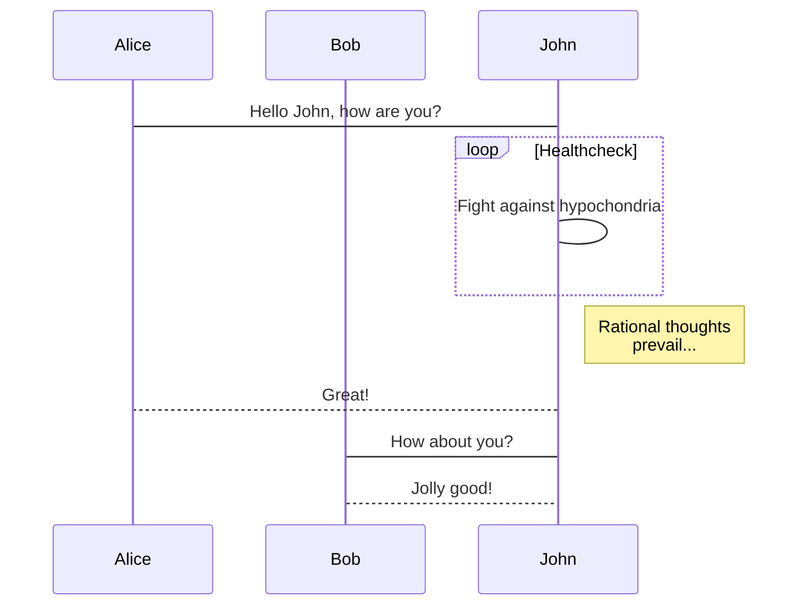
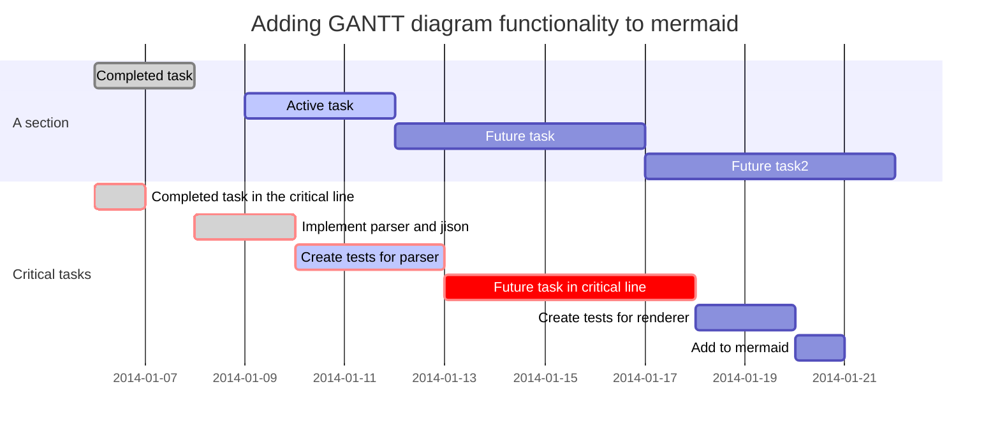
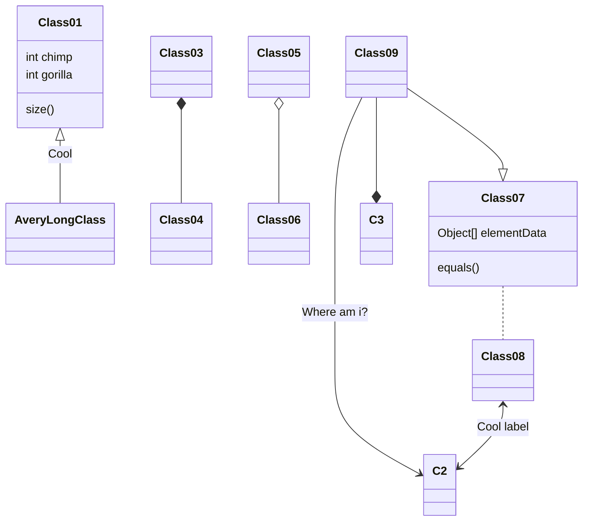

## Mermaid

Mermaid plugin is a simple markdown-like script language for generating charts from text via javascript.

### Flowchart


This 'example of a flowchart' is rendered by **```mermaid** code sample :

```md
graph TD;
    A-->B;
    A-->C;
    B-->D;
    C-->D;
```

### Sequence diagram



This 'sequence diagram' is rendered by **```mermaid** code sample :

```md
    (```)mermaid
    sequenceDiagram
        participant Alice
        participant Bob
        Alice->John: Hello John, how are you?
        loop Healthcheck
            John->John: Fight against hypochondria
        end
        Note right of John: Rational thoughts <br/>prevail...
        John-->Alice: Great!
        John->Bob: How about you?
    (```)
```

## Gantt


This 'exemple of Gantt' is rendered by **```mermaid** code sample :

```md
(```)mermaid
gantt
        dateFormat  YYYY-MM-DD
        title Adding GANTT diagram functionality to mermaid
        section A section
        Completed task            :done,    des1, 2014-01-06,2014-01-08
        Active task               :active,  des2, 2014-01-09, 3d
        Future task               :         des3, after des2, 5d
        Future task2               :         des4, after des3, 5d
        section Critical tasks
        Completed task in the critical line :crit, done, 2014-01-06,24h
        Implement parser and jison          :crit, done, after des1, 2d
        Create tests for parser             :crit, active, 3d
        Future task in critical line        :crit, 5d
        Create tests for renderer           :2d
        Add to mermaid                      :1d
(```)
```

### Class



When you copy the code, remember to remove the parenthesis () around quotes (```) !

```md
(```)mermaid
classDiagram
Class01 <|-- AveryLongClass : Cool
Class03 *-- Class04
Class05 o-- Class06
Class07 .. Class08
Class09 --> C2 : Where am i?
Class09 --* C3
Class09 --|> Class07
Class07 : equals()
Class07 : Object[] elementData
Class01 : size()
Class01 : int chimp
Class01 : int gorilla
Class08 <--> C2: Cool label
(```)
```

### Git graph


When you copy the code, remember to remove the parenthesis () around quotes (```) !

```md
(```)mermaid
gitGraph:
options
{
    "nodeSpacing": 150,
    "nodeRadius": 10
}
end
commit
branch newbranch
checkout newbranch
commit
commit
checkout master
commit
commit
merge newbranch
(```)
```

### Online live editor
An editor is available for creating diagrams. With it you can quickly start writing mermaid diagrams. It is possible to:

+ save the result as a svg
+ get a link to a viewer of the diagram
+ get a link to edit of the diagram to share a diagram so that someone else can tweak it and send a new link back

### Resources

+ [Mermaidjs]: https://mermaidjs.github.io/
+ [Live editor]: https://mermaidjs.github.io/mermaid-live-editor/
+ [Github]: https://github.com/mermaidjs
+ [Github Flowchart]:https://github.com/mermaidjs/flowchart
+ [Github Mermaid]: https://github.com/knsv/mermaid
+ [Mermaidjs]: https://mermaidjs.github.io/
